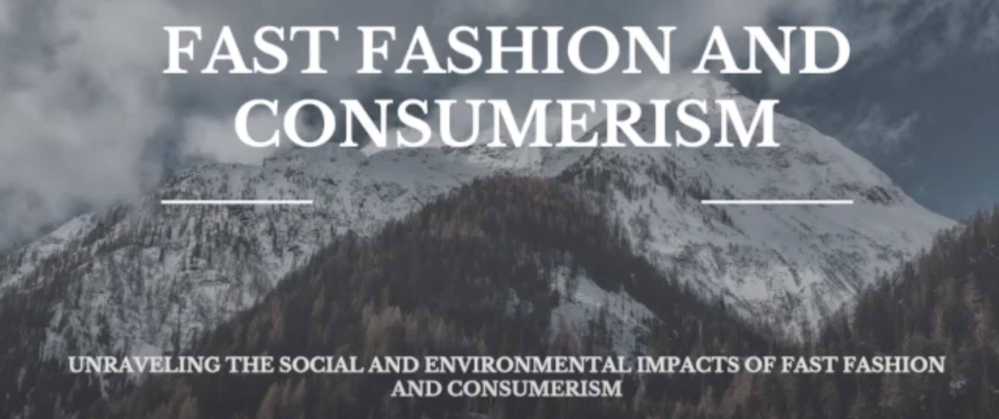

  

Over the summer of 2023, I enrolled in a sociology class where we were tasked to perform a CSL (Community Service Learning) project. In my hometown in Northern California, we have multiple giant thrift stores that are mostly run by volunteer efforts from the community. I thought this would be a perfect opportunity to partake and gain firsthand experience in addressing a small part of the fast fashion problem. 

Studying in a smaller town like mine allows you to see the direct and immediate consequences of consumerist habits while recognizing the potential for meaningful change and positive impacts. For this project, I spent many hours volunteering at the thrift store, helping in all aspects it had to offer. The experiences I had here still influence my mindset, especially pertaining to consumerism and fashion.

In this project, I analyzed the fast fashion issue from micro, meso, and macro levels while relating my findings to theoretical frameworks and sociological theorists. 

If you're curious to learn more about fast fashion, click [here](https://www.youtube.com/watch?v=8zACQA8Vjxs) for my short video.
